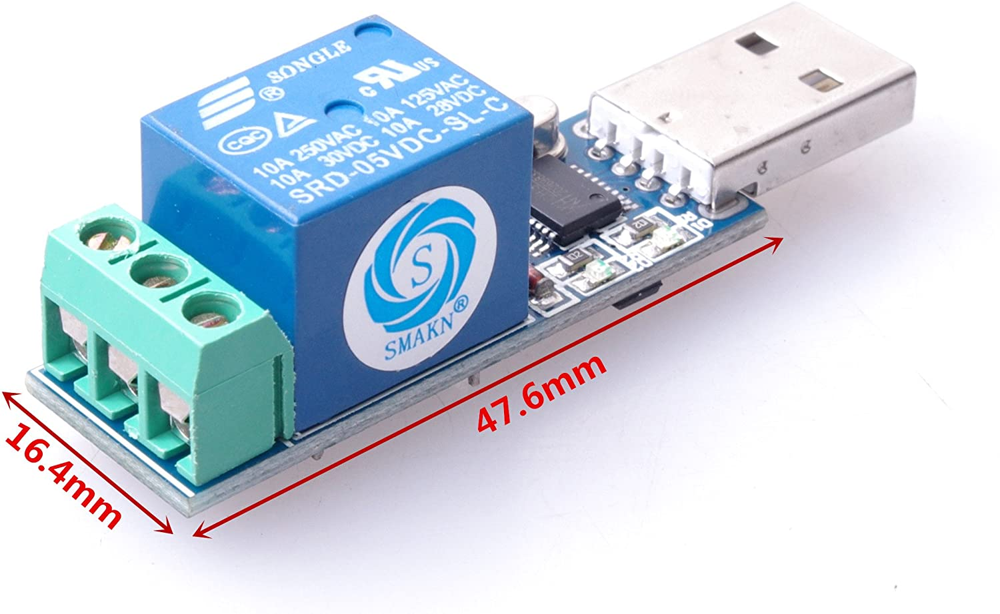

# LCUS-1 USB Relay Control

* C++ and Python code used to control an LCUS-1 USB relay.
<br>


* On Linux, you don't usually need any extra drivers if you see the following in `dmesg`:

```
# dmesg | grep tty
[    0.045680] printk: console [tty0] enabled
[    1.025659] 00:00: ttyS0 at I/O 0x3f8 (irq = 4, base_baud = 115200) is a 16550A
[    1.532197] systemd[1]: Created slice system-getty.slice.
[    5.121271] usb 4-1: ch341-uart converter now attached to ttyUSB0
```

* Since "everything is a file", you can test if your device is working by directly writing bytes to the tty file: 
  * Turn it on: `echo -n -e '\xA0\x01\x00\xA1' > /dev/ttyUSB0`
  * Turn it off: `echo -n -e '\xA0\x01\x00\xA1' > /dev/ttyUSB0`
