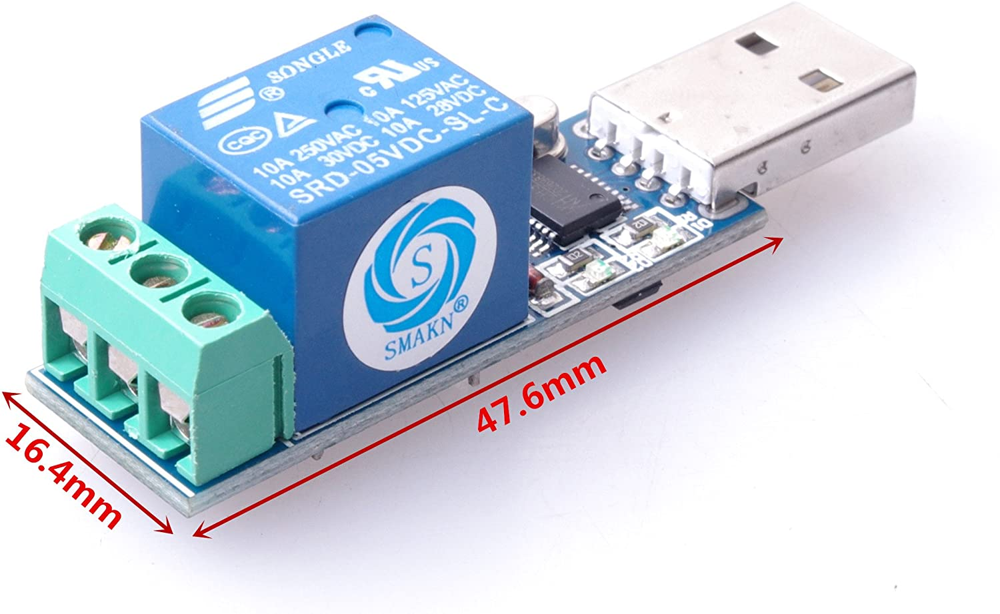
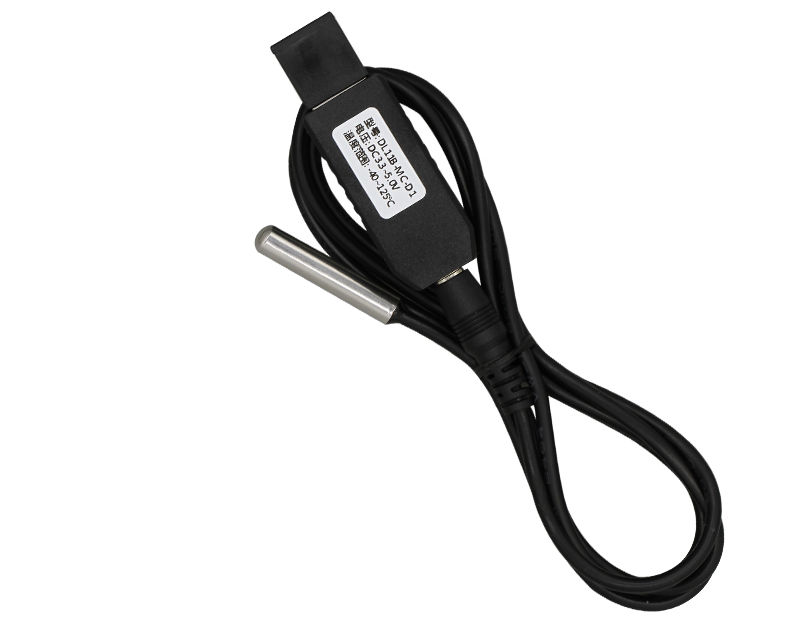
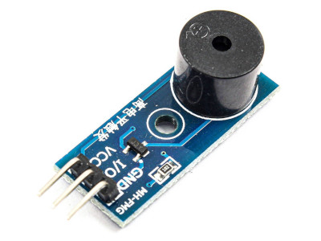
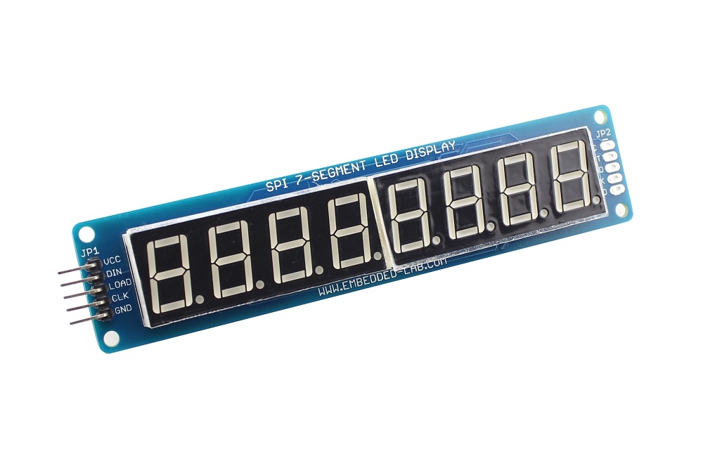

# libiotctrl

- The repository wraps methods to control the following IoT devices in C and provides language bindings when needed:

  - LCUS-1 relays (`relay.h`).
    <br />
    
  - DL11-MC series temprature sensors (`temp-sensor.h`).
    <br />
    
  - Common high level trigger active buzzers (`buzzer.h`).
    <br />
    
  - Common 8-digit 7-segment displays that use a 74hc595 shift register
    (`7segment-display.h`)
    <br />
    </img>

## Build and install

- Dependencies

  - `cmake` as build system: `apt install cmake`
  - `libmodbus` to provide support to Modbus RTU protocol:
    `apt install libmodbus-dev`
    - Can find its document [here](https://libmodbus.org/)
  - `gpiod` to provide generic GPIO support: `apt install libgpiod-dev`

- Build and install

```
mkdir -p ./build && cd build
cmake ../
make
sudo make install
```

### Node.js binding

- Node.js binding is provided for temp-sensor only.

- Dependencies

  - `node` (>= v14.18) and `npm` (>= 6.14)
  - `node-gyp` to build Node.js native addon: `npm install node-gyp`
  - Built `libiotctrl.so` according to [Build and install](#build-and-install)

- Build Node.js native addon

```
cd ./src/bindings/node
node-gyp configure
node-gyp build
```

- Test: `node temp_sensor.js`

### Python binding

- Build and install `libiotctrl.so` according to
  [Build and install](#build-and-install)

- `temp-sensor-tool.py` can be used to test the functionality of the binding.

## Device details

### LCUS-1 relay

- On Linux, you don't usually need any extra drivers if you see the
  following in `dmesg`:

```
# dmesg | grep tty
[    0.045680] print: console [tty0] enabled
[    1.025659] 00:00: ttyS0 at I/O 0x3f8 (irq = 4, base_baud = 115200) is a 16550A
[    1.532197] systemd[1]: Created slice system-getty.slice.
[    5.121271] usb 4-1: ch341-uart converter now attached to ttyUSB0
```

- Since "everything is a file", you can test if your device is working by
  directly writing bytes to the tty file:
  - Turn it on: `echo -n -e '\xA0\x01\x01\xA2' > /dev/ttyUSB0`
  - Turn it off: `echo -n -e '\xA0\x01\x00\xA1' > /dev/ttyUSB0`

### DL11B-MC temprature sensor

- The Chinese manual from its manufacturer is saved
  [here](./assets/dl11-mc_manual.pdf)

### 8-digit 7-segment display: How does a 74HC595 shift register work

- Have you ever found yourself wanting to control lots of LED’s? Well, you could
  wire up a few sensors to Raspberry Pi GPIO pins, but you would rapidly start
  to run out of pins.

- The solution for this is to use a 'shift register'. The 595 essentially
  controls eight separate output pins, using only three input pins.

- A digital tube has two 8-bit registers: a shift register and a storage
  register. The trick is:

  - We use one pin (a.k.a. Clock or SCLK) to provide regular pulse, telling
    the 595 how frequently data are supplied.
  - We use another pin (a.k.a data or DI0) to write 0's and 1's to the shift
    register by following the frequency of the SCLK pin.
  - We use a third pin (a.k.a latch or RCLK) to copy what is in the shift
    register to the storage register
  - Since the storage register has 8 bits, it can control the 7-segment LEDs of
    one single digit plus a dot after it.

  </img>

- But we have 8 digits, how can we use one 8-bit storage register to control
  all of them? The answer is: we don't. Each time we can only control what
  to show on one digit only. However, if we repeat the process fast enough,
  even if we are only able to light up segment LEDs of one digit at a
  time, to human eyes, it still appears that we can control 8 digits
  concurrently.
- If we make the program run slowly, naked eyes can also notice that
  digits are refreshed one after another.

  </img>

- Useful reference
  [here](https://lastminuteengineers.com/74hc595-shift-register-arduino-tutorial/)
